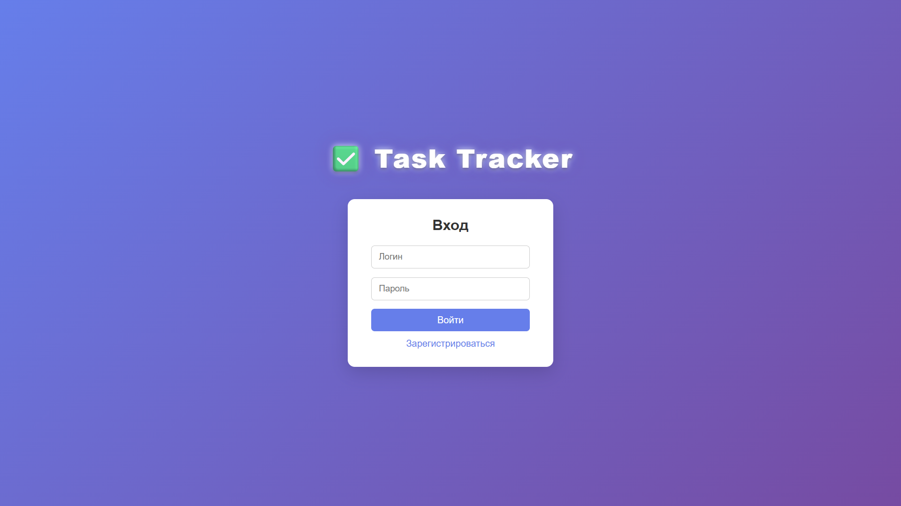
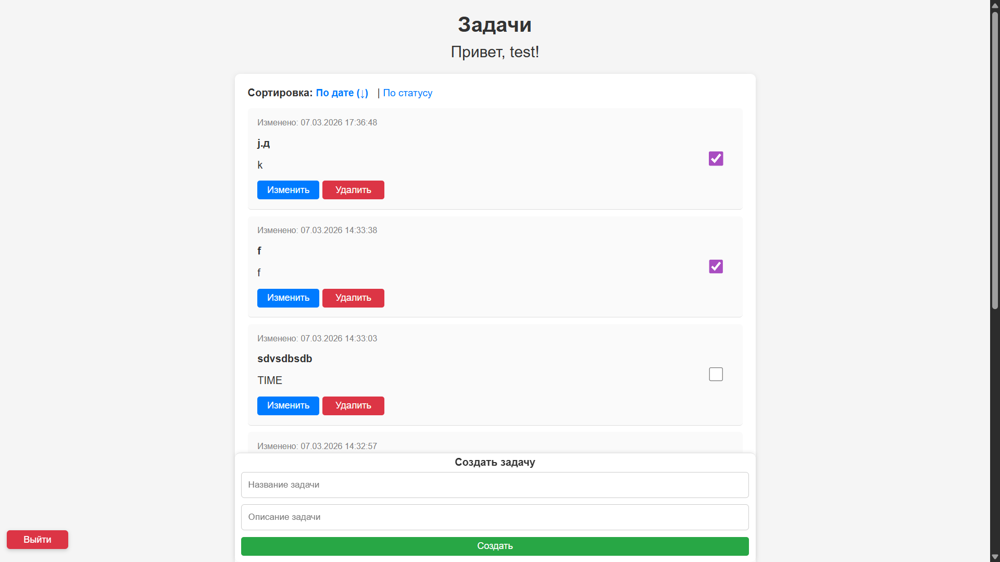
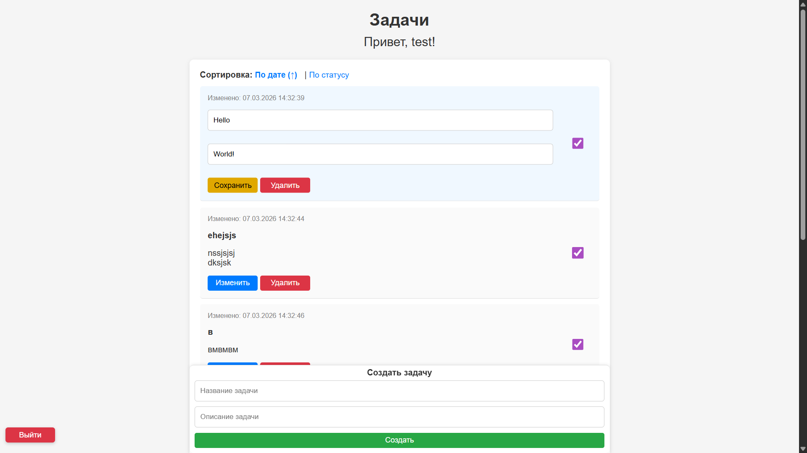

# 🟢 Web-Tracker

Web-Tracker — это full-stack веб-приложение для управления задачами с авторизацией пользователей и REST API на FastAPI.

---

## Скриншоты

### Авторизация


### Заметки


### Изменение заметки


## 🚀 Возможности

- Регистрация и авторизация пользователей (JWT + cookies)
- Создание, редактирование и удаление задач
- Сортировка задач по дате и статусу
- Разделение задач по пользователям
- AJAX-обновление данных без перезагрузки страницы
- Защита маршрутов (доступ только авторизованным пользователям)

---

## 🛠 Технологии

- Python
- FastAPI
- SQLAlchemy
- Jinja2
- PostgreSQL
- JWT
- HTML / CSS / JavaScript

---

## ⚙️ Запуск проекта

```bash
git clone https://github.com/your-username/Web-Tracker.git
cd Web-Tracker

pip install -r requirements.txt
uvicorn main:app --reload
```
---

## Лицензия

Проект распространяется под лицензией MIT. Подробнее — в файле [LICENSE](LICENSE).
